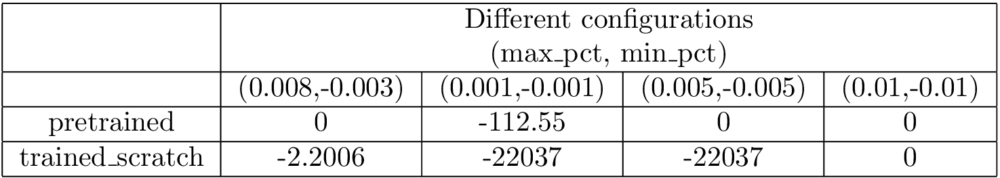

# Chronos_stock_Forecasting
# Stock Price Forecasting with Chronos

## Overview

This project implements a framework for forecasting stock prices using historical data, leveraging the Chronos model. The primary goal is to derive insights from the forecast and generate trading signals ('buy', 'sell', or 'hold') to inform trading decisions.

## Solution Approach

We chose to approach this as a time series problem rather than a classification problem. This method provides more flexibility and control, allowing for modifications to the existing trading model based on real-time events without requiring model retraining.

The framework uses Chronos[1], which treats forecasting as a classification problem for Large Language Models (LLMs) by quantizing time series values and tokenizing them.

## Implementation Steps

1. **Data Preprocessing**: Prepare the data for training the Chronos model.
2. **Feature Extraction**: Select a subset of features, including the closing price, for model training.
3. **Model Training**: Train the model using the prepared dataset, with periodic checkpointing.
4. **Forecast Generation**: Generate forecasts for each data point based on a fixed context size of historical data.
5. **Action Generation**: Derive trading actions ('buy', 'sell', 'hold') from the forecasted data.
6. **Trading**: Use the generated actions to simulate trading the stock.

## Evaluation

We evaluated three models:
1. Original pretrained Chronos model
2. Chronos model trained on the given dataset
3. Signal generated with RSI value

Surprisingly, the original pretrained model outperformed the model trained specifically on our dataset. This is likely due to the pretrained model's exposure to a wide variety of time series datasets, making it more robust.

## Performance

Both the pretrained model and the model trained from scratch outperformed the provided trading blotter when configured correctly. The trading blotter had a cumulative reward of -12231 for the given data.

## References

[1] [Chronos: Learning the Language of Time Series](https://arxiv.org/pdf/2403.07815)

[2] [Chronos Forecasting Scripts](https://github.com/amazon-science/chronos-forecasting/tree/main/scripts)

[3] [Hugging Face Model: amazon/chronos-t5-large](https://huggingface.co/amazon/chronos-t5-large)
